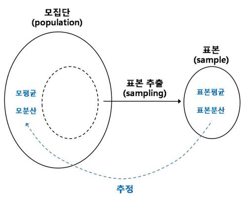
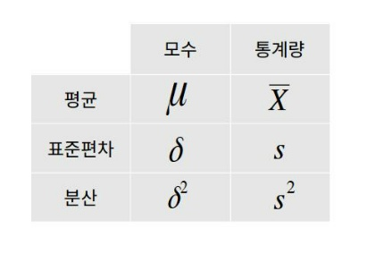

# 1. 기초 통계학

#### 통계학의 개념
###### - 사전적 의미: 산술적 방법을 기초로 하여, 주로 다량의 데이터를 관찰하고 정리 및 분석하는 방법을 연구하는 수학의 한 분야.

모집단(population): 조사의 관심이 되는 전체 집단   
표본(sample): 모집단의 일부 샘플링하여 실제 조사한 대상   
모수(parameter): 모집단으로부터 계산된 모든 값 (전수조사를 해야 알 수 있는 미지의 수)   
통계량(statics): 표본으로부터 계산된 모든 값   
 - 통계량을 이용하여 모집단의 특성을 알아내는 과정을 **추론 통계 분석**이라 한다.
 - 추론 통계는 예측, 머신 러닝 등을 통해서 나온 분석의 결과가 통계적으로 유의한지를 검증하는 역할을 한다.

